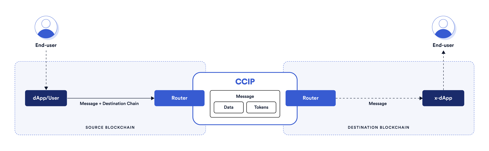

# CRAFTING-CCIP

# Table of Contents
- [CRAFTING-CCIP](#crafting-ccip)
- [Table of Contents](#table-of-contents)
  - [Author](#author)
    - [Pedro Machado](#pedro-machado)
  - [Disclaimer](#disclaimer)
  - [Introduction](#introduction)
  - [Motivation](#motivation)
  - [Basic Architecture of CCIP](#basic-architecture-of-ccip)
  - [What is Chainlink Cross Chain Interoperability Protocol?](#what-is-chainlink-cross-chain-interoperability-protocol)
  - [Requirements](#requirements)
  - [Quickstart](#quickstart)
  - [Setup environment variables](#setup-environment-variables)
  - [Masterclassess](#masterclassess)
  - [M1](#m1)
    - [Sending a message from Avalanche Fuji network to Sepolia network](#sending-a-message-from-avalanche-fuji-network-to-sepolia-network)
      - [Land](#land)
      - [Set of Smart Contracts](#set-of-smart-contracts)
      - [Deploying Smart Contracts](#deploying-smart-contracts)
      - [Sending the message](#sending-the-message)
    - [CONGRATULATIONS :)](#congratulations-)
    - [My own tech summary](#my-own-tech-summary)
  - [M2](#m2)
    - [Transferring ERC20 from Sepolia to Fuji](#transferring-erc20-from-sepolia-to-fuji)
    - [Types of Tokens Supported](#types-of-tokens-supported)
    - [Land](#land-1)
    - [Coding the Smart Contract](#coding-the-smart-contract)
    - [Contract's path](#contracts-path)
      - [ChainsListerOperator.sol](#chainslisteroperatorsol)
      - [CCIPTokenSender.sol](#cciptokensendersol)
    - [Deploying contracts](#deploying-contracts)
    - [Funding your CCIPTokenSender](#funding-your-cciptokensender)
    - [Transfer tokens](#transfer-tokens)
    - [CONGRATULATIONS! You have completed the Transfer Token between Chains journey.](#congratulations-you-have-completed-the-transfer-token-between-chains-journey)
    - [My own tech](#my-own-tech)


## Author 

### Pedro Machado

<p align="center">

<br/>


## Disclaimer

This summary is provided for learning and teaching purposes only. It is intended to offer insights into the Chainlink-Cross Contract Interoperability Protocol (CCIP) and its functionalities. The information presented here is not intended as financial or investment advice. Readers are encouraged to conduct their own research and seek professional advice before making any investment decisions. The content should not be construed as a recommendation or endorsement of any specific investment assets. We do not assume responsibility for any actions taken based on the information provided in this summary.

## Introduction

This is a report for a set of masterclasses with the objective of describing CCIP (Chainlink-Cross Contract Interoperability Protocol). We are following the [Chainlink CCIP](https://andrej-rakic.gitbook.io/chainlink-ccip/getting-started/chainlink-ccip) masterclass to learn and demonstrate how this protocol works.

## Motivation

The blockchain industry has evolved to a new level where there exists the necessity to connect isolated networks to share data between them. The future of Web3 and Blockchain aims to be more cooperative and less competitive for DApps that accept data for every blockchain, still being secure and efficient.

## Basic Architecture of CCIP

<p align="center">

<br/>


## What is Chainlink Cross Chain Interoperability Protocol?

The Chainlink Cross-Chain Interoperability Protocol (CCIP) provides a single simple interface through which dApps and Web3 entrepreneurs can securely meet all their cross-chain needs, including token transfers and arbitrary messaging.

How you can watch this?: Imagine an ocean with a lot of islands (blockchains), each one with its government, culture, society, and economy. However, they are isolated, meaning they lack direct communication channels to transport information.

Chainlink Cross Chain Interoperability Protocol unlocks the feature for isolated blockchains to share data (i.e: tokens (ERC20, ERC721), or any message) between them.

## Requirements

1. Blockchain skills
2. Solidity skills
3. Basic Foundry Skills
4. Git skills
5. Your favorite IDE (VS Code)
6. The latest version of Foundry installed
7. The latest version of Nodejs installed
8. Metamask on your web browser

 
## Quickstart

```bash
git clone https://github.com/Blockitus/crafting-ccip.git
cd crafting-ccip
npm install
forge install
```


## Setup environment variables

Create a `.env` file into your project and paste the code above:

```bash
PRIVATE_KEY=
ETHEREUM_SEPOLIA_RPC_URL=""
AVALANCHE_FUJI_RPC_URL=""
```
Place your API_KEYS and your PRIVATE_KEY into the environment variables.

**Note: Ensure that you are not using a wallet with real funds and put the `.env` file into the `.gitignore`.**

Run 

```bash
source .env
```
**Note: You have configured your `foundry.toml` file, so you don't have to make any changes there.** 

## Masterclassess

## M1

### Sending a message from Avalanche Fuji network to Sepolia network

Here is a basic example of sending data between two isolated blockchains.


#### Land

- **Source Chain: Avalance Fuji**

- **Destination Chain: Ethereum Sepolia**

#### Set of Smart Contracts

Source Chain side

**CCIPSender_Unsafe.sol**

This contract should be deployed on the source chain. The `CCIPSender_Unsafe::send(receiver, someText, destinationChainSelector)` function submits a message with text that you want to be sent to the destination blockchain. 

**Note: You have to previously install `@chainlink package`**

```bash
npm i @chainlink/contracts-ccip --save-dev
```


```javascript
// SPDX-License-Identifier: MIT
pragma solidity ^0.8.19;

import {Client} from "@chainlink/contracts-ccip/src/v0.8/ccip/libraries/Client.sol";
import {IRouterClient} from "@chainlink/contracts-ccip/src/v0.8/ccip/interfaces/IRouterClient.sol";
import {LinkTokenInterface} from "./LinkTokenInterface.sol";

contract CCIPSender_Unsafe {
    address router;
    address link;

    constructor(address _router, address _link) {
        router = _router;
        link = _link;
        LinkTokenInterface(link).approve(router, type(uint256).max);
    }

    function send(address receiver, string memory someText, uint64 destinationChainSelector) external {
        Client.EVM2AnyMessage memory message = Client.EVM2AnyMessage({
            receiver: abi.encode(receiver),
            data: abi.encode(someText),
            tokenAmounts: new Client.EVMTokenAmount[](0),
            extraArgs: "",
            feeToken: link
        });

        IRouterClient(router).ccipSend(destinationChainSelector, message);
    }

}

```
Compile

Check if the smart contract builds fine. 

```bash
forge build
```

If it is not, correct any bugs and try to compile again.

**CCIPReceiver_Unsafe.sol**

Destination Chain side

This smart contract should be deployed on the destination chain. This contract tracks the latest state variables like `latestSender` and `latestMessage`.

**Note: Please don't forget that you have previously installed the `@chainlink-ccip` package.**

```javascript
// SPDX-License-Identifier: MIT
pragma solidity ^0.8.19;

import {CCIPReceiver} from "@chainlink/contracts-ccip/src/v0.8/ccip/applications/CCIPReceiver.sol";
import {Client} from "@chainlink/contracts-ccip/src/v0.8/ccip/libraries/Client.sol";

contract CCIPReceiver_Unsafe is CCIPReceiver {

    address public latestSender;
    string public latestMessage;

    constructor(address router) CCIPReceiver(router) {}

      function _ccipReceive(Client.Any2EVMMessage memory message) internal override {
        latestSender = abi.decode(message.sender, (address));
        latestMessage = abi.decode(message.data, (string));
      }
}

```

Compile

Check if the smart contract builds fine. 

```bash
forge build
```

If it is not, correct any bugs and try to compile again.


#### Deploying Smart Contracts

To deploy the smart contracts, you need faucet tokens in your wallet

1. [Getting Sepolia ETH faucet native token](https://sepoliafaucet.com/) 
2. [Getting Avalanche Fuji AVAX faucet native token](https://faucets.chain.link/fuji) 

Deploy `CCIPSender_Unsafe.sol`

```bash
forge create --rpc-url avalancheFuji --private-key=$PRIVATE_KEY src/CCIPSender_Unsafe.sol:CCIPSender_Unsafe --constructor-args 0x554472a2720E5E7D5D3C817529aBA05EEd5F82D8 0x0b9d5D9136855f6FEc3c0993feE6E9CE8a297846
```

Deploy `CCIPReceiver_Unsafe.sol`

```bash
forge create --rpc-url ethereumSepolia --private-key=$PRIVATE_KEY src/CCIPReceiver_Unsafe.sol:CCIPReceiver_Unsafe --constructor-args 0xD0daae2231E9CB96b94C8512223533293C3693Bf
```
Yeahh!!! We have deployed our smart contracts in the correspondent isolated blockchains. 
Now we can send a message from the source chain `Avalanche Fuji` to the destination chain `Ethereum Sepolia`.

#### Sending the message

Let's got to send the message: `"THANK YOU BLOCKITUS"` from the Fuji to Sepolia. 

Prepare:

- The address of the address of the CCIPReceiver_Unsafe.sol smart contract you previously deployed to Ethereum Sepolia, as the receiver parameter;
- The Text Message you want to send, for example "THANK YOU BLOCKITUS", as the someText parameter;
- 16015286601757825753, which is the CCIP Chain Selector for the Ethereum Sepolia network, as the destinationChainSelector parameter.

Run

```bash 
cast send <CCIP_SENDER_UNSAFE_ADDRESS> --rpc-url avalancheFuji --private-key=$PRIVATE_KEY "send(address,string,uint64)" <CCIP_RECEIVER_UNSAFE_ADDRESS> "THANK YOU BLOCKITUS" 16015286601757825753
```

You can now monitor live the status of your CCIP Cross-Chain Message via [CCIP Explorer](https://ccip.chain.link/). Just paste the transaction hash into the search bar and open the message details.

### CONGRATULATIONS :) 

You have now the basic comprehension about CCIP.

### My own tech summary 

If you don't want to walk through the process of building the system (NOT RECOMMENDED, BECAUSE YOU HAVE TO LIVE YOUR OWN EXPERIENCE) and the only thing you want is to test the process of sending a message through the Land, I'll provide you with the addresses of my smart contracts deployed in the corresponding blockchains. Please, if you feel good, share your scripts with me to communicate with my smart contracts :).


**ADDRESS_CCIPReceiver_Unsafe_INTO_SEPOLIA** 
```bash 
0x5a972422eBFE8ea65fb2Ac644B7af258b031BCbD
```

**TRX_HASH_CCIPReceiver_Unsafe_INTO_SEPOLIA**
 ```bash
 0xc7ed9ab8e90b13669412ccfca4569d8cd48cc71d8907b7f88b1989623aacd3b3
 ```

**ADDRESS_CCIPSender_Unsafe_INTO_FUJI**
```bash
0x5a972422eBFE8ea65fb2Ac644B7af258b031BCbD
```

**TRX_HASH_CCIPReceiver_Unsafe_INTO_FUJI** 
```bash
0xb42f83e1cfb055a4eaeab400ebd7f2f7a345e342afdca3a1a32428866f2473e7
```

**TRX_HASH_OF_MESSAGE_SENT**
```bash
0x2899f43ec998fb79992da287844108ea629746856f0b8a28e8e063a17efe8402
```
## M2
### Transferring ERC20 from Sepolia to Fuji

Now that we've seen how to send a text message in an insecure way from one blockchain to another, let's try to send some tokens from a smart contract deployed on the source chain to an EOA on the destination chain in a secure way.

### Types of Tokens Supported

Chainlink CCIP allows us to transfer tokens from the source chain to the destination chain. However, we can't send any token; only those tokens supported by the land can be sent. The token we want to send should exist in both the source chain and the destination chain.

Chainlink CCIP has two types of token categories:

- CCIP-BnM
    This type of token uses the Burn and Mint handling mechanism to transfer tokens. Source chains burn the amount of tokens that you want to transfer, and the destination chains mint the same amount in the receiver's address.
- CCIP-LnM
    Tokens are locked on the source chain (in Token Pools), and wrapped/synthetic/derivative tokens that represent the locked tokens are minted on the destination chain.

Which of the two handling mechanisms we need to use depends on the token's behavior.

To save time, Chainlink has two ERC20 test tokens that represent those categories. For the purpose of this report, we will use the CCIP-BnM test token in the land described below.

### Land

Remember, the land is the pathway to transport information between two blockchains in CCIP. Lands are unidirectional; it is not the same path to transfer information from Fuji to Sepolia instead of Sepolia to Fuji. For this example, we will take into account the second land mentioned.

**Note: Chainlink CCIP has a list of Lands supported. Follow its official [documentation](https://docs.chain.link/ccip/supported-networks/v1_2_0/testnet) to see other options.**


**Properties**

Sepolia Source Chain:
- Router address: `0x0BF3dE8c5D3e8A2B34D2BEeB17ABfCeBaf363A59`
- Chain selector: `16015286601757825753`
- Supported Fee token selected: 
  - Link: `0x779877A7B0D9E8603169DdbD7836e478b4624789`
- Address of CCIP-BnM: `0xFd57b4ddBf88a4e07fF4e34C487b99af2Fe82a05`

Fuji Destination Chain: 
- Chain selector: `14767482510784806043`
- Address of CCIP-BnM: `0xD21341536c5cF5EB1bcb58f6723cE26e8D8E90e4`


### Coding the Smart Contract

For our cross chain dapp, we need to develop a smart contract that transacts our tokens from the source chain (Sepolia) to the destination chain (Fuji). 

### Contract's path

```bash

..src/M2/
.CCIPTokenSender.sol
.ChainsListerOperator.sol
```

#### ChainsListerOperator.sol

This smart contract handles the destination chain selectors supported by the protocol. 

```javascript
// SPDX-License-Identifier: MIT
pragma solidity 0.8.19;

import {OwnerIsCreator} from "@chainlink/contracts-ccip/src/v0.8/shared/access/OwnerIsCreator.sol";

contract ChainsListerOperator is OwnerIsCreator {
    
    mapping(uint64 => bool) public whitelistedChains;

    error DestinationChainNotWhitelisted(uint64 destinationChainSelector);
    error DestinationChainAlreadyWhiteListed(uint64 destinationChainSelector);

    modifier onlyWhitelistedChain(uint64 _destinationChainSelector) {
        if (!whitelistedChains[_destinationChainSelector])
            revert DestinationChainNotWhitelisted(_destinationChainSelector);
        _;
    }

    function whitelistChain( uint64 _destinationChainSelector) external onlyOwner {
        if (whitelistedChains[_destinationChainSelector]) revert DestinationChainAlreadyWhiteListed(_destinationChainSelector);
        whitelistedChains[_destinationChainSelector] = true;
    }

     function denylistChain(uint64 _destinationChainSelector) external onlyOwner {
        if(!whitelistedChains[_destinationChainSelector]) revert DestinationChainNotWhitelisted(_destinationChainSelector);
        whitelistedChains[_destinationChainSelector] = false;
    }

}
```

#### CCIPTokenSender.sol

This smart contract allows us to transfer tokens.

```javascript
// SPDX-License-Identifier: MIT
pragma solidity 0.8.19;

import {IRouterClient} from "@chainlink/contracts-ccip/src/v0.8/ccip/interfaces/IRouterClient.sol";
import {Client} from "@chainlink/contracts-ccip/src/v0.8/ccip/libraries/Client.sol";
import {IERC20} from "@chainlink/contracts-ccip/src/v0.8/vendor/openzeppelin-solidity/v4.8.0/contracts/interfaces/IERC20.sol";
import {ChainsListerOperator} from "./ChainsListerOperator.sol";

contract CCIPTokenSender is ChainsListerOperator {
    IRouterClient router;
    IERC20 linkToken;

    address constant public NATIVE_TOKEN = address(uint160(uint256(keccak256(abi.encodePacked("NATIVE_TOKEN")))));
    
    
    error InsufficientBalance(uint256 currentBalance, uint256 calculatedFees);
    error NothingToWithdraw();
    error InvalidReceiverAddress();

    event TokensTransferred(
        bytes32 indexed messageId, // The unique ID of the message.
        uint64 indexed destinationChainSelector, // The chain selector of the destination chain.
        address receiver, // The address of the receiver on the destination chain.
        address token, // The token address that was transferred.
        uint256 tokenAmount, // The token amount that was transferred.
        address feeToken, // the token address used to pay CCIP fees.
        uint256 fees // The fees paid for sending the message.
    );

    event Withdrawal(address indexed beneficiary, address indexed token, uint256 amount);


    constructor(address _router, address _linkToken) {
        router = IRouterClient(_router);
        linkToken = IERC20(_linkToken);
    }

    receive() external payable{}

    function transferTokensPaylinkToken(
        uint64 _destinationChainSelector, 
        address _receiver, 
        address _token, 
        uint256 _amount) external onlyOwner onlyWhitelistedChain(_destinationChainSelector) returns (bytes32 messageId) {
            
            if (_receiver == address(0)) revert InvalidReceiverAddress();
            Client.EVM2AnyMessage memory message = buildCcipMessage(
                _receiver,
                _token,
                _amount,
                address(linkToken)
            );
            
            uint256 fees = _ccipFeesManagement(_destinationChainSelector, message);

            IERC20(_token).approve(address(router), _amount);

            messageId = router.ccipSend(_destinationChainSelector, message); 

            emit TokensTransferred(
            messageId,
            _destinationChainSelector,
            _receiver,
            _token,
            _amount,
            address(linkToken),
            fees
            );   
        
        }

    function withdraw(address _beneficiary) external {
        uint256 amount = address(this).balance;
        if (amount == 0) revert NothingToWithdraw();
        payable(_beneficiary).transfer(amount);
        emit Withdrawal(_beneficiary, NATIVE_TOKEN, amount);
    }

    function withdrawToken(
        address _beneficiary,
        address _token
    ) public onlyOwner {
        uint256 amount = IERC20(_token).balanceOf(address(this));
        
        if (amount == 0) revert NothingToWithdraw();
        
        IERC20(_token).transfer(_beneficiary, amount);
        emit Withdrawal(_beneficiary, _token, amount);
    }

    function buildCcipMessage(
        address _receiver, 
        address _token,
        uint256 _amount,
        address _feeTokenAddress
    ) public pure returns (Client.EVM2AnyMessage memory message) {
        
        Client.EVMTokenAmount[] memory tokenAmounts = new Client.EVMTokenAmount[](1);
        Client.EVMTokenAmount memory tokenAmount = Client.EVMTokenAmount({
                token: _token,
                amount: _amount
            });
        
        tokenAmounts[0] = tokenAmount;

        message = Client.EVM2AnyMessage({
            receiver: abi.encode(_receiver),
            data:"",
            tokenAmounts: tokenAmounts,
            extraArgs: Client._argsToBytes(
            Client.EVMExtraArgsV1({gasLimit: 0})
            ),
            feeToken: _feeTokenAddress
        });

    }

    function _ccipFeesManagement(uint64 _destinationChainSelector, Client.EVM2AnyMessage memory message) private returns(uint256 fees) {
        fees = router.getFee(_destinationChainSelector, message);
        uint256 currentBalance = linkToken.balanceOf(address(this));
        if (fees > currentBalance) revert InsufficientBalance(currentBalance, fees);
        linkToken.approve(address(router), fees);
    }
}
```

### Deploying contracts

**Note: Remember before doing this, you need to have set up your environment variables.** 

Set up
```bash
source .env
```

Run
```bash
forge create --rpc-url ethereumSepolia --private-key=$PRIVATE_KEY src/M2/CCIPTokenSender.sol:CCIPTokenSender --contructor-args 0x0BF3dE8c5D3e8A2B34D2BEeB17ABfCeBaf363A59 0x779877A7B0D9E8603169DdbD7836e478b4624789
```

### Funding your CCIPTokenSender

Great! Now you are a genius. However, you need to fund your CCIPTokenSender with the amount of fee tokens (in this case, we will use 1 LINK) and the amount of tokens that you want to send (in this case, 1000000000000000 CCIP-BnM, equal to 0.001 CCIP-BnM).

In your Metamask wallet, you have imported both tokens on the Sepolia source chain. To send tokens to the contract, place the CCIPTokenSender address in the token receive field and send the amount corresponding to the token.

**This is too easy to show how you can do it, please take an effort about it.**


### Transfer tokens

Yeah! Finally, we arrive at the final step of our journey.

Once we have our CCIPTokenSender smart contract funded with fee tokens and the tokens that we want to send, we need to whitelist our destination chain-selector.

Prepare
- Fuji chain-selector: `14767482510784806043`

Run

```bash
cast send <CCIP_TOKEN_SENDER_ADDRESS> --rpc-url ethereumSepolia --private-key=$PRIVATE_KEY "whitelistChain(uint64)" 14767482510784806043
```

Now that we have whitelisted our destination chain-selector, we can transfer the amount of tokens to the EOA.

Prepare
- Fuji chain-selector: `14767482510784806043`
- Receiver address: `<RECEIVER_ADDRESS>`
- Token address: `0xFd57b4ddBf88a4e07fF4e34C487b99af2Fe82a05`
- Amount: `1000000000000000` 

Run
```bash
cast send <CCIP_TOKEN_SENDER_ADDRESS> --rpc-url ethereumSepolia --private-key=$PRIVATE_KEY "transferTokensPaylinkToken(uint64,address,address,uint256)" 14767482510784806043 <RECEIVER_ADDRESS> 0xFd57b4ddBf88a4e07fF4e34C487b99af2Fe82a05 1000000000000000
```

AWESOME!!! Now you have the hash of the transaction in your CLI, you can paste it into the [Chainlink-CCIP-Explorer](https://ccip.chain.link/) to monitor the state of your transaction. 

### CONGRATULATIONS! You have completed the Transfer Token between Chains journey.

### My own tech

If you don't want to walk through the process of building the system (NOT RECOMMENDED, BECAUSE YOU HAVE TO LIVE YOUR OWN EXPERIENCE) and the only thing you want is to test the process of sending tokens through the Land, I'll provide you with the CCIPTokenSender address of my smart contract deployed on Sepolia. You could change the destination chain selector if you want to test something different. Please let me know what you did.


**CCIPTokenSender_INTO_SEPOLIA**
`0x278CB9c0e1Dd49Aa525e9B9F4E543c3C7EC3C07D`

**MessageID**
`0x6d098e08094d4c8d5beeb0a07228e9e4fe9dbb3909c62486b24157c868ac830a`

[Chainlink_CCIP_Explorer_Transaction](https://ccip.chain.link/msg/0x6d098e08094d4c8d5beeb0a07228e9e4fe9dbb3909c62486b24157c868ac830a)
